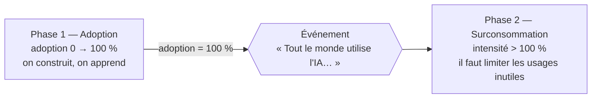
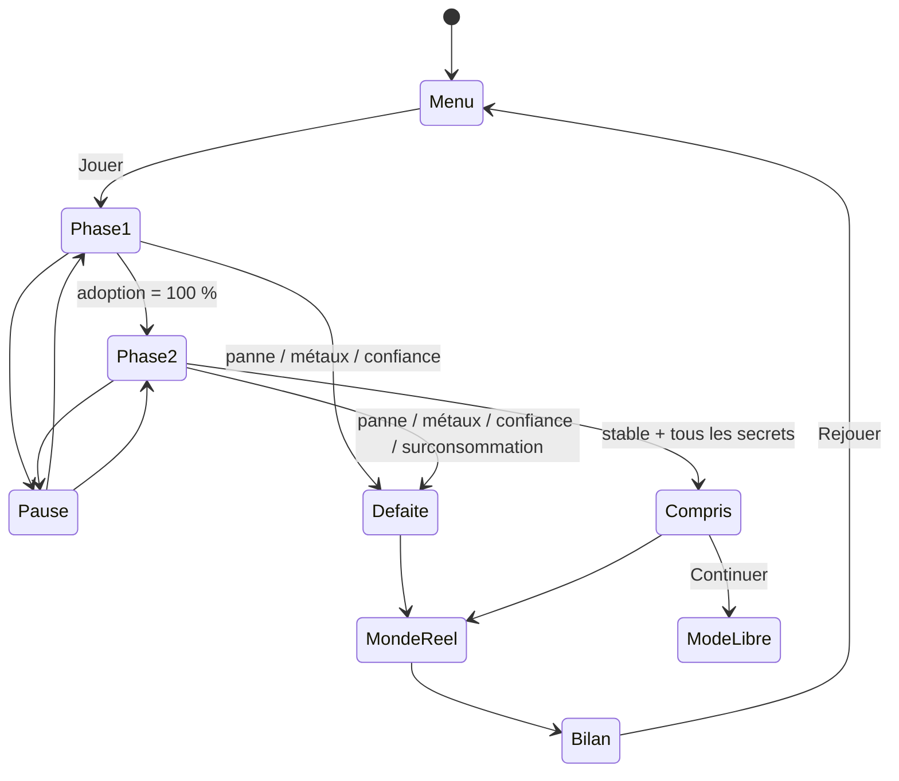
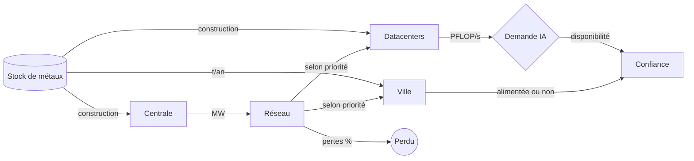
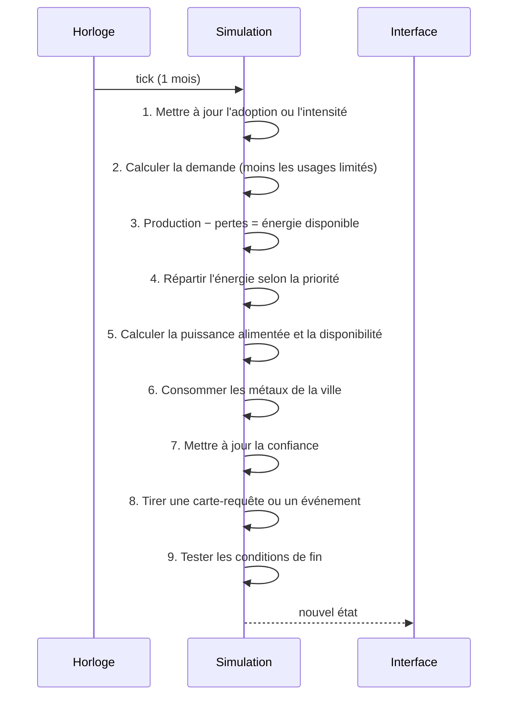
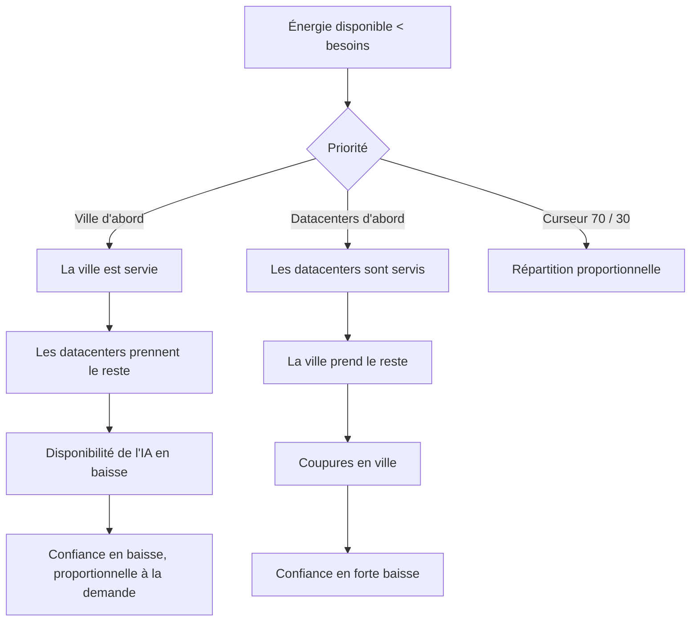

# 2. Logique du jeu

[← Vision](01-vision.md) · [Sommaire](../../../../Downloads/flopsy-maj-docs-data%202/docs/README.md) · [Données →](../../../../Downloads/flopsy-maj-docs-data%202/docs/03-donnees.md)

## Sommaire du chapitre

1. [Principe général](#21-principe-général)
2. [Monde de jeu](#22-monde-de-jeu)
3. [Temps et rythme](#23-temps-et-rythme)
4. [Unités](#24-unités)
5. [Éléments du jeu](#25-éléments-du-jeu)
6. [Règles](#26-règles)
7. [Les deux phases](#27-les-deux-phases)
8. [Cartes-requêtes et événements](#28-cartes-requêtes-et-événements)
9. [Fins de partie](#29-fins-de-partie)
10. [Secrets et fiches](#210-secrets-et-fiches)
11. [Contrôles](#211-contrôles)
12. [Diagrammes](#212-diagrammes)
13. [Décisions à valider](#213-décisions-à-valider)

---

## 2.1 Principe général

Le joueur gère une ville sur une petite planète fictive aux ressources limitées. Il doit répondre à une demande d'IA
générative qui ne cesse de croître (habitants, entreprises, outils du quotidien) en construisant des datacenters, sans
épuiser les métaux critiques et l'énergie, et sans perdre la confiance du public.

## 2.2 Monde de jeu

- **Une planète fictive**, plus petite que la Terre, avec des ressources réduites. Son échelle (par exemple « 1/1000 de
  la Terre ») sert seulement à obtenir des nombres lisibles, et elle est documentée.
- **une carte prédéfinie**, dessinée une fois pour toutes, avec des emplacements constructibles fixes.
  Ce choix évite le coût de la génération procédurale, garantit un équilibrage identique pour tous les élèves et permet
  de placer les secrets à la main.
- **Sur la carte** : la ville au centre, des emplacements pour les datacenters et les centrales, un gisement de métaux
  (visuel du stock) et des éléments de décor qui cachent les secrets.
- La ville et les datacenters consomment tous les deux de l'énergie et des métaux. Quand l'énergie manque, c'est le
  joueur qui fixe la priorité.

## 2.3 Temps et rythme

| Paramètre                       | Valeur                                       |
|---------------------------------|----------------------------------------------|
| 1 tick de simulation            | 1 mois de jeu                                |
| Durée d'un tick à vitesse ×1    | 1,5 s                                        |
| Vitesses                        | Pause, ×1, ×2                                |
| Phase 1 (adoption de 0 à 100 %) | Environ 12 ans de jeu, soit 3 à 4 min        |
| Phase 2 (surconsommation)       | Jusqu'à la fin de la partie, soit 7 à 10 min |
| Durée totale visée              | 10 à 15 min                                  |

L'année de départ peut être 2023 : l'adoption suit alors une courbe proche de la réalité, avec 48 % des Français de 12
ans et plus utilisateurs mi-2025 d'après le Baromètre du numérique (édition 2026).

## 2.4 Unités

| Grandeur                                        | Unité                                    |
|-------------------------------------------------|------------------------------------------|
| Demande IA, puissance de calcul                 | PFLOP/s                                  |
| Énergie produite et consommée                   | MW                                       |
| Stock de métaux critiques, coût de construction | t                                        |
| Consommation continue de métaux                 | t/an                                     |
| Disponibilité de l'IA, confiance du public      | %                                        |
| Taux d'adoption, intensité d'usage              | % (l'intensité dépasse 100 % en phase 2) |

**Formule de la demande :**

```
demande (PFLOP/s) = population × taux d'adoption × intensité d'usage × calcul par utilisateur
```

Le *calcul par utilisateur* est calibré à partir des données ouvertes
(voir [Données](../../../../Downloads/flopsy-maj-docs-data%202/docs/03-donnees.md)).

## 2.5 Éléments du jeu

| Élément                   | Rôle                                                 | Caractéristiques                                                         |
|---------------------------|------------------------------------------------------|--------------------------------------------------------------------------|
| **Demande IA**            | Besoin de calcul de la population et des entreprises | Augmente en continu (PFLOP/s)                                            |
| **Taux d'adoption**       | Part de la population qui utilise l'IA générative    | Monte jusqu'à 100 % pendant la phase 1                                   |
| **Intensité d'usage**     | Quantité d'IA consommée par utilisateur              | Dépasse 100 % en phase 2. Une partie est « non essentielle »             |
| **Puissance de calcul**   | Capacité totale disponible                           | Somme des datacenters alimentés (PFLOP/s)                                |
| **Disponibilité de l'IA** | Part de la demande réellement satisfaite             | `min(1, puissance alimentée / demande)`                                  |
| **Datacenter**            | Bâtiment qui apporte de la puissance de calcul       | Coût unique en métaux (t), consommation continue d'énergie (MW)          |
| **Centrale (fictive)**    | Seule source d'énergie                               | Un seul type. Production (MW) et coût en métaux à calibrer               |
| **Réseau électrique**     | Distribue l'énergie                                  | Pertes en %, réductibles par une amélioration du réseau                  |
| **Métaux critiques**      | Ressource finie                                      | Stock (t) qui baisse avec les constructions et, lentement, avec la ville |
| **Ville**                 | Consommatrice d'énergie et de métaux                 | Énergie en continu (MW) et un peu de métaux (t/an)                       |
| **Confiance du public**   | Opinion sur l'IA et sur la gestion du joueur         | 0 à 100 %. Baisse si la ville ou l'IA manque d'énergie                   |
| **Priorité d'énergie**    | Réglage du joueur                                    | un curseur ville / datacenters par paliers de 10 %                       |

## 2.6 Règles

**Construction et ressources**

- Si le joueur construit un datacenter, il dépense des métaux une fois et consomme de l'énergie en continu.
- Si le joueur construit une centrale, la production d'énergie augmente (et il dépense des métaux).
- Si le joueur améliore le réseau, les pertes d'énergie diminuent.
- Si la ville existe, elle consomme en continu de l'énergie et un peu de métaux. Le stock baisse donc même sans nouvelle
  construction.
- Si le stock de métaux est épuisé, plus aucune construction n'est possible.

**Répartition de l'énergie**

- Si l'énergie disponible (production moins pertes) est inférieure aux besoins, elle est répartie selon la priorité
  choisie, et le secteur non prioritaire manque d'énergie.
- Si la ville manque d'énergie, la confiance baisse fortement.
- Si les datacenters manquent d'énergie, la puissance de calcul alimentée baisse, donc la disponibilité de l'IA aussi.

**Confiance**

- Si la disponibilité de l'IA baisse, la confiance baisse **proportionnellement à la demande** : plus la demande est
  haute (fin de partie), plus le manque coûte cher.
- Si tout va bien, la confiance remonte lentement.
- Si le joueur limite des usages inutiles, la confiance baisse un peu sur le moment (les habitants râlent), puis se
  stabilise.

**🟡 Proposition de formule (à équilibrer en playtest)** :

```
Δconfiance par tick =
  − a × (1 − disponibilité) × (demande / demande_de_référence)
  − b × part de la ville non alimentée
  − c × usages limités ce tick
  + d × (1 − confiance)              ← remontée lente si aucun manque
```

## 2.7 Les deux phases



**Phase 1 : adoption.** L'adoption passe de 0 à 100 %. Le joueur découvre les mécaniques : construire, alimenter, régler
la priorité. Sacrifier les datacenters coûte encore peu, car la demande est faible.

**Passage en phase 2.** Un écran plein annonce : *« Bravo, toute la ville utilise l'IA ! … Mais elle en
veut toujours plus. »* La jauge Adoption devient la jauge **Intensité**, qui peut dépasser 100 %, et le panneau
**Usages** apparaît.

**Phase 2 : surconsommation.** L'intensité d'usage continue de monter. Une part de cette intensité est **non
essentielle**, répartie entre les vraies catégories d'usage de Compar:IA (divertissement, génération d'images pour rire,
requêtes en double, mode réflexion activé pour une question simple…). Dans le panneau Usages, le joueur peut **limiter
chaque catégorie**. La demande baisse, au prix d'une petite baisse de confiance sur le moment. C'est le levier principal
de cette phase : construire toujours plus ne suffit plus.

## 2.8 Cartes-requêtes et événements

**Cartes-requêtes.** À intervalle régulier, une carte apparaît : une vraie demande tirée des prompts suggérés par
Compar:IA, réécrite pour le jeu. Par exemple : *« Un habitant demande une histoire sans la lettre « e », pour
s'amuser. »*
(voir [chapitre 3, § 3.2 A](../../../../Downloads/flopsy-maj-docs-data%202/docs/03-donnees.md#a-les-prompts-suggérés--la-source-des-cartes-requêtes)).
Le
joueur choisit :

- **Accepter** : la demande augmente un peu et la confiance monte un peu ;
- **Refuser** : la demande reste stable, et l'effet sur la confiance dépend de l'utilité de la requête.

Les cartes sont tirées en fonction des catégories d'usage réelles de Compar:IA. Chaque carte est classée « utile » ou
« confort » et affiche une fourchette d'énergie.

**Événements inspirés du réel :**

| Événement                | Effet en jeu                                                                                | Lien avec le réel                                           |
|--------------------------|---------------------------------------------------------------------------------------------|-------------------------------------------------------------|
| Canicule                 | Le refroidissement est moins efficace : +X % de consommation des datacenters pendant N mois | Les vagues de chaleur et le refroidissement des datacenters |
| Tension sur les métaux   | Le coût des constructions augmente temporairement                                           | La concentration géographique de la production (USGS)       |
| Nouveau modèle à la mode | Pic de demande soudain                                                                      | La diffusion très rapide des outils d'IA générative         |

## 2.9 Fins de partie

| Fin                                 | Condition                                                                                        | Écran « Et dans le monde réel ? »                                                                                    |
|-------------------------------------|--------------------------------------------------------------------------------------------------|----------------------------------------------------------------------------------------------------------------------|
| ⚡ **Panne**                        | Ville non alimentée à plus de 50 % pendant 6 mois de suite                                       | Consommation réelle des datacenters en France et projections de l'ADEME                                              |
| ⛏️ **Métaux épuisés**               | Stock à 0 et demande non couverte pendant 12 mois                                                | Réserves réelles et concentration géographique (USGS)                                                                |
| 😠 **Perte de confiance**           | Confiance à 0 %                                                                                  | Part des Français méfiants envers l'IA (Baromètre du numérique)                                                      |
| 🔥 **Surconsommation**              | Intensité au-dessus d'un seuil critique sans aucun usage limité                                  | Énergie réelle des usages (Compar:IA, en fourchette)                                                                 |
| 🌍 **« Tu as compris les enjeux »** | Phase 2, disponibilité ≥ 90 % et confiance ≥ 50 % pendant 10 ans **et** tous les secrets trouvés | « Ta planète a tenu. Dans le monde réel, les projections prévoient… » La planète reste ensuite ouverte en mode libre |

**Score** : le nombre d'années tenues en phase 2, plus un bonus pour la confiance moyenne et pour le
stock de métaux restant. Il s'affiche sur l'écran de bilan à côté des graphiques de la partie.

## 2.10 Secrets et fiches

Des éléments de décor cliquables sur la carte débloquent des **fiches** qui contiennent un chiffre réel et sa source.
Elles se rangent dans un **carnet**. Quelques fiches ne s'obtiennent qu'en atteignant la fin « Tu as compris les
enjeux ».

Exemples de fiches :

| Fiche                              | Donnée                                                                                        |
|------------------------------------|-----------------------------------------------------------------------------------------------|
| Les datacenters en France          | Consommation en 2023 et part de l'électricité nationale (SDES)                                |
| Près de chez toi                   | Datacenters recensés par région (OpenStreetMap)                                               |
| La moitié des Français             | Adoption de l'IA générative et méfiance (Baromètre du numérique 2026)                         |
| Réfléchir coûte cher               | Un modèle avec raisonnement consomme en moyenne environ 30 fois plus (AI Energy Score)        |
| Boîtes noires                      | La transparence moyenne des grands modèles passe de 58 à 40 sur 100 entre 2024 et 2025 (FMTI) |
| Les métaux des puces               | Gallium, germanium : qui les produit ? (USGS)                                                 |
| 2035                               | Les scénarios de l'ADEME pour les data centers                                                |
| Une conversation, combien de kWh ? | La fourchette Compar:IA par catégorie d'usage                                                 |

## 2.11 Contrôles

| Action                       | Souris / clavier                     | Tactile       |
|------------------------------|--------------------------------------|---------------|
| Déplacer la caméra           | Clic maintenu ou ZQSD / flèches      | Glisser       |
| Zoomer                       | Molette                              | Pincer        |
| Construire / sélectionner    | Clic gauche                          | Toucher       |
| Priorité ville / datacenters | Curseur dans la barre latérale       | Curseur       |
| Limiter un usage             | Interrupteurs dans le panneau Usages | Interrupteurs |
| Pause                        | Échap ou Espace                      | Bouton pause  |

Pas de rotation de la vue : la carte isométrique est fixe, ce qui la rend plus simple à prendre en main et à coder.

## 2.12 Diagrammes

### États du jeu



### Flux de ressources



### Un tick de simulation



### Décision quand l'énergie manque



## 2.13 Décisions à valider

Les points ouverts de la v2, avec la proposition retenue dans ce document. Ils sont tous à figer pendant la tâche
**T01**.

| # | Point ouvert                                                         | Proposition                                                                                            |
|---|----------------------------------------------------------------------|--------------------------------------------------------------------------------------------------------|
| 1 | Type de carte                                                        | Prédéfinie, avec emplacements fixes                                                                    |
| 2 | Calibration (calcul par utilisateur, MW par datacenter, t de métaux) | Calculée par le script `data/` (tâche T19)                                                             |
| 3 | Consommation de métaux de la ville                                   | Environ 2 à 5 % du stock initial sur toute une partie : visible sans dominer                           |
| 4 | Représentation des usages inutiles                                   | Une part non essentielle de l'intensité, par catégorie Compar:IA, limitable dans le panneau Usages     |
| 5 | Conditions de victoire et de défaite                                 | Voir le tableau de la section 2.9                                                                      |
| 6 | Centrale fictive                                                     | Un seul type, sans risque. Production et coût calibrés pour que 3 à 5 centrales suffisent à une partie |
| 7 | Priorité ville / datacenters                                         | Curseur par paliers de 10 %                                                                            |
| 8 | Formule de perte de confiance                                        | Voir la section 2.6, coefficients a, b, c, d réglés en playtest                                        |
| 9 | Annonce de la phase 2                                                | Écran plein, la jauge Adoption devient Intensité, le panneau Usages apparaît                           |
