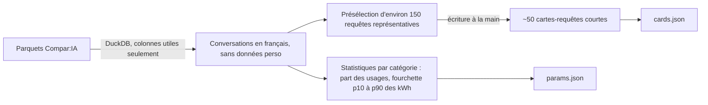

# 3. Données ouvertes

[← Logique du jeu](02-logique-du-jeu.md) · [Sommaire](README.md) · [Technique →](04-technique.md)

## Sommaire du chapitre

1. [Comment les données entrent dans le jeu](#31-comment-les-données-entrent-dans-le-jeu)
2. [Analyse des jeux de données proposés](#32-analyse-des-jeux-de-données-proposés)
3. [Compar:IA en détail](#33-comparia-en-détail)
4. [Sources par paramètre du jeu](#34-sources-par-paramètre-du-jeu)
5. [Rendre les données visibles](#35-rendre-les-données-visibles)
6. [Traçabilité et reproductibilité](#36-traçabilité-et-reproductibilité)
7. [Hypothèses et limites](#37-hypothèses-et-limites)
8. [Licences](#38-licences)
9. [Références](#39-références)

---

## 3.1 Comment les données entrent dans le jeu

Il y a trois usages, du plus technique au plus visible :

1. **Elles calibrent la simulation.** Chaque paramètre s'appuie sur une donnée réelle. On ne divise pas tout par un même facteur : on conserve les **proportions** réelles (part des datacenters dans l'électricité, rythme de croissance de la demande, rapport entre le stock de métaux et les besoins annuels). Quelle que soit la taille de la planète, le jeu raconte la même histoire que le monde réel.
2. **Elles fournissent le contenu.** Les cartes-requêtes et les catégories d'usage viennent de Compar:IA.
3. **Elles expliquent.** Les écrans « Et dans le monde réel ? », les fiches des secrets, l'Encyclopédie et les graphiques du bilan s'appuient tous sur ces données.

## 3.2 Analyse des jeux de données proposés

| Jeu de données | Verdict | Usage dans Flopsy | Points d'attention |
|---|:-:|---|---|
| **Compar:IA** (Ministère de la Culture) | ✅ **Oui, c'est le cœur** | Cartes-requêtes, catégories d'usage de la phase 2, énergie par conversation | Gros volume (environ 4 Go en parquet) ; énergie estimée, donc à afficher en fourchette |
| **Consommation d'électricité et de gaz par IRIS des sites industriels** (ODRÉ) | ❌ **Non** | Aucun usage | Les datacenters n'y sont pas identifiés (pas de secteur ni de code NAF), seuls les sites raccordés au réseau de transport sont comptés, la maille IRIS n'a pas de sens sur une planète fictive, et la dernière mise à jour date de décembre 2024 |
| **Datacenters sur OpenStreetMap** (`telecom=data_center`) | 🟡 **Partiel** | La fiche « Près de chez toi » : datacenters recensés par région | Données contributives et incomplètes, donc à présenter comme « au moins N recensés ». Licence ODbL. Une seule extraction Overpass datée suffit |
| **AI Energy Score** (Hugging Face et partenaires) | ✅ **Oui, pour la phase 2** | Justifie l'usage non essentiel « mode réflexion ». Selon la v2 (décembre 2025), un modèle avec raisonnement consomme **en moyenne environ 30 fois plus**, et jusqu'à 150 à 700 fois plus pour un même modèle | Mesure du GPU seul (borne basse). Licence du leaderboard à vérifier. À utiliser en complément de Compar:IA |
| **Foundation Model Transparency Index** (Stanford) | 🟡 **Partiel** | La fiche « Boîtes noires », liée à la jauge Confiance : la transparence moyenne passe de **58/100 (2024) à 40/100 (2025)** | Le lien du CSV pointe l'édition de mai 2024 : utiliser l'édition de décembre 2025. C'est un chiffre de contexte, pas un paramètre de calcul |

**Bilan** : deux sources deviennent le cœur du jeu (Compar:IA, AI Energy Score), deux servent de fiches (OSM, FMTI) et une est écartée pour des raisons argumentées (IRIS industriel). Le reste vient de sources françaises officielles (section 3.4), qui sont plus faciles à défendre.

## 3.3 Compar:IA en détail

Les données sont publiées en 3 parquets sur data.gouv.fr (licence Etalab 2.0, mise à jour du 3 juin 2026) et aussi sur Hugging Face (`ministere-culture/comparia-conversations`, `-votes`, `-reactions`).

### Champs utiles (jeu « conversations »)

| Champ | Utilisation |
|---|---|
| `categories`, `keywords` | Catégories d'usage de la phase 2, poids du tirage des cartes |
| `opening_msg` | Point de départ des cartes-requêtes |
| `selected_category`, `is_unedited_prompt` | Repérer les prompts suggérés par la plateforme : courts, clairs, faciles à transformer en cartes |
| `total_conv_a_kwh` / `total_conv_b_kwh` | Énergie estimée par conversation (méthode EcoLogits) |
| `total_conv_a_output_tokens`, `model_a_total_params`, `model_a_active_params` | Relier l'énergie à la longueur des réponses et à la taille des modèles |
| `languages` | Garder le français |
| `contains_pii` | Écarter les conversations qui contiennent des données personnelles |

### Pipeline



1. Lire les parquets avec **DuckDB** sans tout charger en mémoire : seulement les colonnes utiles.
2. Calculer, par catégorie, la **part des usages** et la **fourchette d'énergie** (p10 à p90).
3. Présélectionner des requêtes représentatives de chaque catégorie.
4. Les **réécrire en cartes de jeu** : une phrase, la catégorie, la fourchette d'énergie, et l'identifiant Compar:IA d'origine pour la traçabilité.

Les jeux « votes » et « réactions » ne servent pas au gameplay.

## 3.4 Sources par paramètre du jeu

| Paramètre du jeu | Donnée réelle | Source | Licence |
|---|---|---|---|
| Consommation d'un datacenter et croissance | Consommation des datacenters en France 2018-2023 : 3,9 TWh en 2023 (sites de plus de 1 GWh), +21 % entre 2022 et 2023, 64 % en Île-de-France | **SDES** (fichier xlsx) | Données publiques, à citer |
| Part des datacenters dans l'électricité | Environ 1 à 1,5 % de la consommation française (SDES). Contexte mondial : environ 415 TWh en 2024 (AIE) | **SDES**, **AIE**, **Ember / Our World in Data** | AIE : citer le chiffre seulement. Ember / OWID : CC BY |
| Trajectoire future (graphique du bilan) | Scénario tendanciel 2035 : environ 105 TWh pour les usages français, dont 36,7 TWh dans des centres situés en France ; de la division par 2 à la multiplication par 7 selon les scénarios | **ADEME** (janvier 2026) | Conditions de réutilisation à vérifier |
| Consommation de la ville | Consommation électrique par habitant | **RTE éco2mix** (données consolidées, API ODRÉ), **Eurostat** | Licence Ouverte 2.0 |
| Centrale | Part du nucléaire, facteur de charge, CO₂ du mix | **RTE éco2mix**, **Bilan électrique RTE** | Licence Ouverte 2.0 |
| Pertes du réseau | Taux de pertes | **Bilan électrique RTE** | Licence Ouverte 2.0 |
| Métaux critiques | Réserves, production, concentration géographique | **USGS Mineral Commodity Summaries 2026**, **BRGM minerals-info** | USGS : domaine public |
| Criticité des métaux | Liste européenne des matières premières critiques | **RMIS** (Commission européenne) | Réutilisation avec citation |
| Courbe d'adoption (phase 1) | 20 % des Français utilisateurs en 2023, 48 % en 2026 ; 85 % des 18-24 ans | **Baromètre du numérique 2026** (CRÉDOC, Arcep…) | Licence Ouverte |
| Répartition des usages (phase 2) | Part des usages par catégorie | **Compar:IA** | Etalab 2.0 |
| Énergie d'un usage | kWh par conversation, en fourchette | **Compar:IA** (estimations EcoLogits) | Etalab 2.0 |
| Surcoût du raisonnement | Environ 30 fois plus d'énergie en moyenne | **AI Energy Score v2** | À vérifier |
| Confiance initiale | 52 % des Français se méfient de l'IA | **Baromètre du numérique 2026** | Licence Ouverte |
| Comparaison européenne (fiche) | Usage de l'IA générative dans l'UE | **Eurostat** (enquête TIC auprès des ménages) | CC BY 4.0 |

**Ordre de préférence des sources** : d'abord les sources officielles françaises (data.gouv.fr, SDES, ADEME, RTE, Baromètre, Compar:IA), puis les sources internationales reconnues (Eurostat, USGS, AIE).

## 3.5 Rendre les données visibles

- **Infobulle « D'où vient ce chiffre ? »** sur chaque jauge : le nom de la source et l'année.
- **Encyclopédie**, accessible depuis le menu : tous les jeux de données utilisés. Elle est générée automatiquement à partir de `sources.json`.
- **Écrans « Et dans le monde réel ? »** à chaque fin de partie (voir le chapitre 2, section 2.9).
- **Graphiques du bilan** : la courbe de la partie à côté de la trajectoire réelle (scénarios ADEME).
- **Catégories réelles** : les usages limitables en phase 2 reprennent les vraies catégories de Compar:IA.
- **Crédits des données**, avec les licences.

## 3.6 Traçabilité et reproductibilité

**Tableau de traçabilité** (stocké dans `public/data/sources.json` et repris dans l'Encyclopédie) :

| Paramètre | Donnée | Source (lien) | Licence | Année / version | Transformation |
|---|---|---|---|---|---|
| `ville.conso_mw_par_hab` | Consommation électrique par habitant | RTE éco2mix | Licence Ouverte 2.0 | 2025 | Moyenne annuelle ÷ population × échelle |
| … | … | … | … | … | … |

**Dossier `data/` du dépôt :**

```
data/
├── raw/            # fichiers bruts téléchargés (ou script de téléchargement si trop lourds)
├── scripts/
│   ├── fetch.py    # téléchargement daté des sources
│   ├── comparia.py # requêtes DuckDB sur les parquets
│   └── build.py    # brut → public/data/params.json, sources.json
├── notebook.ipynb  # du brut au paramètre, avec graphiques
└── README.md       # comment tout regénérer en une commande
```

**Publication** : le jeu de cartes et les paramètres calibrés sont publiés sur data.gouv.fr. Flopsy produit de l'open data en plus d'en réutiliser.

## 3.7 Hypothèses et limites

Elles sont affichées dans l'Encyclopédie et dans le README :

- **Proportions conservées, échelle réduite** : la planète est une version miniature, et le facteur d'échelle est documenté.
- **Une seule source d'énergie** : la centrale fictive simplifie un mix électrique réel.
- **« Métaux critiques » plutôt que « terres rares »** (voir le chapitre 2, section 2.5).
- **Des estimations incertaines** : les kWh de Compar:IA sont des estimations. Elles sont toujours affichées en fourchette, jamais en chiffre unique. On évite aussi le chiffre souvent cité « une requête IA = 10 recherches Google », ancien et discuté.
- **L'année de chaque donnée** est notée, et les données ne sont pas mises à jour automatiquement.

## 3.8 Licences

| Licence | Obligations | Sources concernées |
|---|---|---|
| Licence Ouverte / Etalab 2.0 | Citer la source et la date | Compar:IA, RTE, Baromètre, SDES |
| ODbL | Mention « © les contributeurs d'OpenStreetMap » ; partage à l'identique si la base dérivée est republiée | OSM |
| CC BY 4.0 | Citer l'auteur | Eurostat, Ember, Our World in Data |
| Domaine public | Aucune (citer par honnêteté) | USGS |
| Licence restrictive | Citer le chiffre, ne pas republier les tableaux | AIE |

## 3.9 Références

- [Compar:IA sur data.gouv.fr](https://www.data.gouv.fr/datasets/compar-ia) · [Compar:IA sur Hugging Face](https://huggingface.co/datasets/ministere-culture/comparia-conversations)
- [Consommation électricité et gaz par IRIS, sites industriels (ODRÉ)](https://www.data.gouv.fr/datasets/consommation-annuelle-definitive-delectricite-et-de-gaz-par-iris-des-sites-industriels-raccordes-aux-reseaux-de-transport)
- [OpenStreetMap France (data.gouv.fr)](https://www.data.gouv.fr/datasets/donnees-openstreetmap-integrales-de-france-metropolitaine)
- [AI Energy Score v2](https://huggingface.co/blog/sasha/ai-energy-score-v2) · [Leaderboard](https://huggingface.co/spaces/AIEnergyScore/Leaderboard)
- [The 2025 Foundation Model Transparency Index](https://arxiv.org/abs/2512.10169v1)
- [SDES : consommation d'électricité des centres de données 2018-2023](https://www.statistiques.developpement-durable.gouv.fr/la-consommation-delectricite-des-centres-de-donnees-entre-2018-et-2023)
- [ADEME : scénarios data centers (synthèse)](https://www.connaissancedesenergies.org/data-centers-en-france-quelle-consommation-delectricite-venir)
- [éco2mix régional sur data.gouv.fr](https://www.data.gouv.fr/datasets/donnees-eco2mix-regionales-temps-reel-1)
- [Baromètre du numérique 2026 : présentation Arcep](https://www.arcep.fr/uploads/tx_gspublication/barometre-du-numerique-edition-2026_PRESENTATION.pdf) · [synthèse](https://www.blogdumoderateur.com/ia-generative-francais-utilisent-adoption-record/)
- [RMIS : matières premières critiques](https://rmis.jrc.ec.europa.eu/eu-critical-raw-materials)
