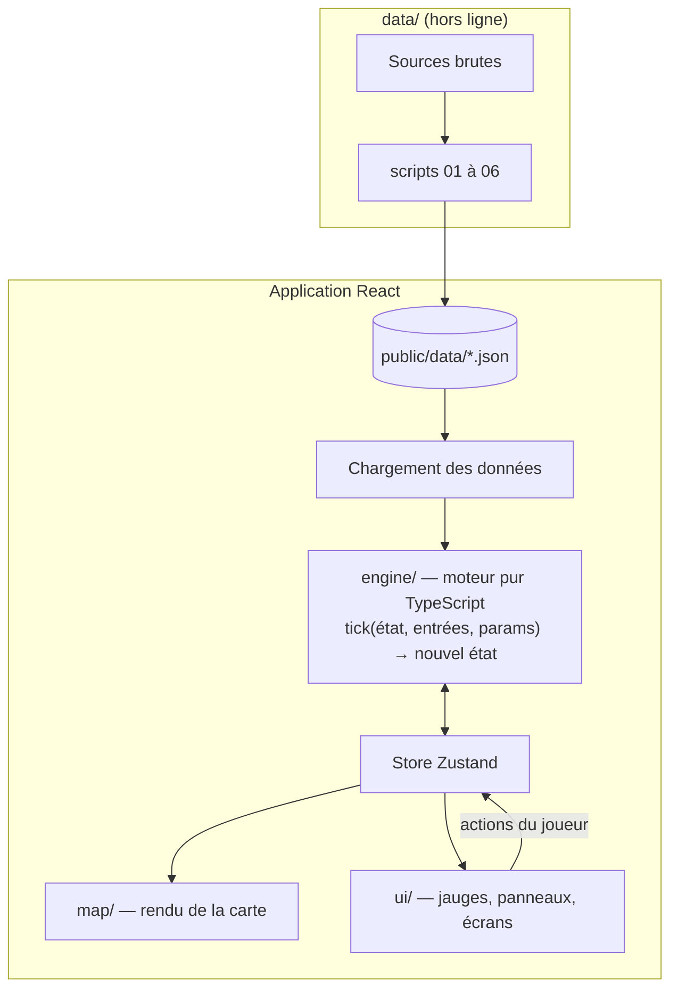

# 4. Architecture technique

[← Données](03-donnees.md) · [Sommaire](README.md) · [Backlog →](05-backlog.md)

## Sommaire du chapitre

1. [Stack](#41-stack)
2. [Principes d'architecture](#42-principes-darchitecture)
3. [Organisation du dépôt](#43-organisation-du-dépôt)
4. [Contrat de données JSON](#44-contrat-de-données-json)
5. [Déploiement](#45-déploiement)
6. [Qualité](#46-qualité)
7. [Mentions légales et confidentialité](#47-mentions-légales-et-confidentialité)

---

## 4.1 Stack

| Besoin            | Choix                                                               | Pourquoi                                                      |
|-------------------|---------------------------------------------------------------------|---------------------------------------------------------------|
| Application       | **React + TypeScript**, build **rsbuild**                           | Déjà en place dans le dépôt                                   |
| Style             | **Tailwind CSS**                                                    | Déjà en place, rapide pour intégrer la maquette               |
| Rendu de la carte | **Three.js** (WebGL), caméra orthographique pour la vue isométrique | En place dans `src/game/iso/` (terrain, bâtiments, contrôles) |
| État du jeu       | **Zustand** (ou `useReducer`)                                       | Un store léger, facile à brancher sur le moteur               |
| Graphiques        | **Recharts**                                                        | Bilan et Encyclopédie                                         |
| Tests             | **Vitest**                                                          | Natif avec l'outillage actuel, rapide                         |
| Données           | **Python + DuckDB** dans `data/`                                    | Lit les gros parquets Compar:IA sans les charger en mémoire   |
| Hébergement       | **Vercel** (site statique)                                          | Déjà en place : prévisualisation à chaque PR                  |

## 4.2 Principes d'architecture



1. **Le moteur est indépendant de l'affichage.** `engine/` ne contient que des fonctions TypeScript pures, sans React ni
   DOM. On peut donc le tester entièrement, et même jouer une partie dans la console.
2. **Il est déterministe.** Le hasard (tirage des cartes, événements) passe par un générateur à graine (seed). Une
   partie se rejoue à l'identique, ce qui aide à équilibrer et à corriger les bugs.
3. **Les données sont séparées du code.** Tous les nombres du jeu vivent dans `params.json`, qui est généré par le
   script `data/`. Équilibrer revient à modifier des données, pas du code.
4. **Le contrat de données est fixé tôt** (tâche T02). L'interface peut avancer avec de fausses données pendant que le
   script `data/` se construit.

## 4.3 Organisation du dépôt

```
Flopsy/
├── docs/                    # cette documentation
├── data/                    # pipeline de données (voir chapitre 3)
├── public/
│   └── data/                # params.json, sources.json, cards.json (+ events.json, fiches.json à venir)
├── src/
│   ├── core/                # écran de chargement, logo, layout racine
│   ├── main_menu/           # menu principal
│   ├── game/
│   │   ├── iso/             # carte isométrique Three.js
│   │   │   ├── controls/    # caméra, clavier, souris, glisser
│   │   │   ├── domain/      # GameState, stock de terres rares, bâtiments, stats
│   │   │   ├── engine/      # IsoMapEngine, horloge d'images, assemblage de la carte
│   │   │   ├── render/      # scène, modèles 3D, réseau électrique, animations
│   │   │   ├── tools/       # construction, démolition, placement
│   │   │   ├── world/       # terrain, décor, coordonnées
│   │   │   ├── react/       # IsoMap, useGameStats
│   │   │   └── util/
│   │   ├── components/      # MapControls, Notification
│   │   ├── navigation/
│   │   ├── pages/
│   │   └── views/           # vue générale, réseau électrique, clusters
│   ├── router.tsx
│   └── index.jsx
├── tests/                   # tests Vitest, même arborescence que src/
└── README.md
```

## 4.4 Contrat de données JSON

**`cards.json`, une carte-requête :**

```json
{
  "id": "card-015",
  "text": "Un habitant demande une histoire sans la lettre « e », pour s'amuser.",
  "usage": "confort",
  "categorie_energie": "Arts",
  "effects": {
    "accept": {
      "demand": 0.4,
      "trust": 1
    },
    "refuse": {
      "demand": 0,
      "trust": -0.3
    }
  },
  "source": {
    "dataset": "Compar:IA - prompts suggérés (utils/suggestions/fr.json)",
    "categorie": "Histoires",
    "prompt_origine": "Écris une histoire en 100 mots, sans utiliser la lettre \"e\", où un enfant découvre…"
  }
}
```

**`params.json`, extrait :**

```json
{
  "version": "2026-11-01",
  "scale": {
    "planet_vs_earth": 0.001,
    "note": "voir docs/03-donnees.md"
  },
  "time": {
    "tick_months": 1,
    "tick_seconds": 1.5,
    "start_year": 2023
  },
  "city": {
    "population": 10000,
    "power_mw": 0.0,
    "metals_t_per_year": 0.0
  },
  "datacenter": {
    "compute_pflops": 0.0,
    "power_mw": 0.0,
    "metals_t": 0.0
  },
  "plant": {
    "power_mw": 0.0,
    "metals_t": 0.0
  },
  "grid": {
    "loss_pct": 0.0,
    "upgrade_loss_pct": 0.0
  },
  "metals": {
    "initial_stock_t": 0.0
  },
  "adoption": {
    "curve": [
      [
        2023,
        0.20
      ],
      [
        2025,
        0.48
      ]
    ]
  },
  "usage_categories": [
    {
      "id": "Arts",
      "share": 0.0,
      "wh": {
        "p10": 0.0,
        "median": 0.0,
        "p90": 0.0
      }
    }
  ],
  "trust": {
    "initial": 0.48,
    "a": 0.0,
    "b": 0.0,
    "c": 0.0,
    "d": 0.0
  }
}
```

> Les `0.0` sont des valeurs remplies par les scripts `data/` puis par la calibration (T19). Le fichier réel généré par
> `05_build_params.py` est dans `public/data/params.json`.

**`sources.json`, une ligne du tableau de traçabilité :**

```json
{
  "param": "city.power_mw",
  "data": "Consommation électrique annuelle par habitant",
  "source": "RTE éco2mix",
  "url": "https://...",
  "license": "Licence Ouverte 2.0",
  "year": 2025,
  "transform": "moyenne annuelle ÷ population × échelle"
}
```

## 4.5 Déploiement

- **Vercel** : chaque push sur `main` déploie la production, et chaque PR obtient une URL de prévisualisation (pratique
  pour faire tester).
- **Attention** : l'offre gratuite Hobby de Vercel est réservée à un usage **non commercial**. Si le projet est facturé
  à un client, passer sur l'offre Pro (environ 20 $/mois).
- Les JSON sont servis comme fichiers statiques et versionnés avec le code.
- Le nom de domaine est optionnel (`flopsy.vercel.app` suffit pour la démo).

## 4.6 Qualité

| Sujet         | Règle                                                                                                                      |
|---------------|----------------------------------------------------------------------------------------------------------------------------|
| Branches      | `feat/…`, `fix/…`, `data/…` ; une PR par fonctionnalité, ce qui donne une prévisualisation Vercel                          |
| Commits       | Conventional Commits (`feat:`, `fix:`, `docs:`…)                                                                           |
| Tests         | Vitest dans `tests/` (même arborescence que `src/`) : formules, conditions de fin, partie complète rejouée avec une graine |
| Lint          | ESLint et Prettier, TypeScript en mode strict                                                                              |
| Accessibilité | Contrastes, navigation au clavier, textes alternatifs ; vérification avec axe et Lighthouse                                |
| Performance   | 60 images/s sur une tablette de classe ; bâtiments regroupés en lots dans Three.js, pas de DOM par tuile                   |
| Suivi         | Board GitHub Projects avec les tâches du [backlog](05-backlog.md)                                                          |

## 4.7 Mentions légales et confidentialité

Le jeu ne collecte **aucune donnée** : pas de compte, pas de cookie, pas d'outil de mesure d'audience. Deux pages
suffisent, et les mentions légales sont obligatoires pour tout site publié en France :

- **Mentions légales** : éditeur, hébergeur (Vercel), contact.
- **Confidentialité** : « Ce jeu ne collecte aucune donnée personnelle et n'utilise aucun cookie. »
