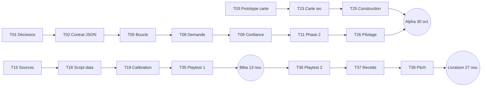

# 5. Backlog

[← Technique](04-technique.md) · [Sommaire](README.md) · [Roadmap →](06-roadmap.md)

## Synthèse

| Lot                               | Contenu                                                      | Tâches |    Jours |
|-----------------------------------|--------------------------------------------------------------|-------:|---------:|
| **A — Socle**                     | Décisions, contrat de données, prototype de carte, outillage |      4 |      3,5 |
| **B — Moteur**                    | Simulation, règles, phases, cartes, événements, tests        |     10 |     10,5 |
| **C — Données**                   | Sources, Compar:IA, calibration, textes, publication         |      7 |      7,5 |
| **D — Interface**                 | Carte, jauges, construction, écrans, Encyclopédie, secrets   |     12 |       13 |
| **E — Livraison**                 | Mentions légales, playtests, recette, documentation, pitch   |      6 |        6 |
| **Total**                         |                                                              | **39** | **40,5** |
| Marge                             |                                                              |        |      3,5 |
| **Capacité (28 sept. → 27 nov.)** |                                                              |        |   **44** |

## Chemin critique

Un retard sur **T05, T09, T23 ou T19** décale toute la suite : ce sont les tâches à surveiller.

---

## Lot A — Socle (3,5 j)

| ID  | Tâche                                                                                                            | Est. | Dépend de | Terminé quand                                                                                         | Sprint |
|-----|------------------------------------------------------------------------------------------------------------------|-----:|-----------|-------------------------------------------------------------------------------------------------------|:------:|
| T01 | Valider les décisions de jeu ouvertes ([chapitre 2, section 2.13](02-logique-du-jeu.md#213-décisions-à-valider)) |    1 | –         | Plus aucune « 🟡 Proposition » dans le chapitre 2                                                     |   S0   |
| T02 | Écrire le contrat de données JSON et un jeu de fausses données                                                   |  0,5 | T01       | Les 5 fichiers de `public/data/` existent avec leurs types TypeScript et un exemple valide            |   S0   |
| T03 | Prototyper la carte isométrique et choisir la techno (Canvas 2D ou PixiJS)                                       |    1 | –         | Une grille de 20 × 20 tuiles tourne à 60 images/s sur tablette ; le choix est noté dans le chapitre 4 |   S0   |
| T04 | Outiller le dépôt : TypeScript strict, ESLint, Vitest, CI, board GitHub Projects                                 |    1 | –         | Une PR lance lint et tests et obtient sa prévisualisation Vercel ; les 39 tâches sont sur le board    |   S0   |

## Lot B — Moteur (10,5 j)

| ID  | Tâche                                                                                                   | Est. | Dépend de | Terminé quand                                                                      | Sprint |
|-----|---------------------------------------------------------------------------------------------------------|-----:|-----------|------------------------------------------------------------------------------------|:------:|
| T05 | Modéliser l'état du jeu et coder la boucle (tick, pause, ×1 / ×2, générateur à graine)                  |  1,5 | T02       | Une partie vide avance mois par mois dans la console ; même graine, même résultat  |   S0   |
| T06 | Énergie : centrale, réseau, pertes, répartition selon le curseur de priorité                            |  1,5 | T05       | Tests verts sur la répartition à 0 %, 50 % et 100 %, avec et sans pertes           |   S1   |
| T07 | Métaux : coût des constructions, consommation de la ville, stock fini, blocage à 0                      |    1 | T05       | Tests verts : le stock baisse sans construction, et rien ne se construit à 0       |   S1   |
| T08 | Demande : courbe d'adoption et formule de la demande                                                    |    1 | T05       | L'adoption suit la courbe de `params.json` ; la demande est testée                 |   S1   |
| T09 | Disponibilité de l'IA et confiance (formule du chapitre 2, section 2.6)                                 |    1 | T06, T08  | Tests verts : un même manque coûte plus cher quand la demande est haute            |   S1   |
| T10 | Fins de partie (4 défaites, « Tu as compris les enjeux ») et mode libre                                 |  0,5 | T09       | Chaque fin est déclenchable par un test                                            |   S1   |
| T11 | Phase 2 : bascule à 100 %, intensité au-dessus de 100 %, usages non essentiels limitables par catégorie |  1,5 | T08, T09  | Limiter une catégorie fait baisser la demande et coûte un peu de confiance (testé) |   S1   |
| T12 | Cartes-requêtes côté moteur : tirage pondéré par catégorie, effets accepter / refuser                   |    1 | T02, T09  | Sur 1 000 tirages, la répartition suit les parts de `params.json`                  |   S1   |
| T13 | Événements inspirés du réel : canicule, tension sur les métaux, modèle à la mode                        |    1 | T05       | Les 3 événements se déclenchent, durent et s'arrêtent correctement                 |   S3   |
| T14 | Test de partie complète rejouée avec une graine                                                         |  0,5 | T10, T11  | Une partie automatique atteint la phase 2 puis une fin, en CI                      |   S1   |

## Lot C — Données (7,5 j)

| ID  | Tâche                                                                                                        | Est. | Dépend de | Terminé quand                                                                                              | Sprint |
|-----|--------------------------------------------------------------------------------------------------------------|-----:|-----------|------------------------------------------------------------------------------------------------------------|:------:|
| T15 | Collecter les sources, vérifier les licences, remplir `sources.json`                                         |    1 | T02       | Chaque paramètre a sa source, sa licence, son année et sa transformation                                   |   S1   |
| T16 | Compar:IA : requêtes DuckDB (parts par catégorie, fourchettes de kWh) et présélection d'environ 150 requêtes |    1 | T15       | Un CSV de statistiques par catégorie et un CSV de requêtes présélectionnées existent                       |   S1   |
| T17 | Écrire environ 50 cartes-requêtes à partir de la présélection                                                |    1 | T16       | `cards.json` contient au moins 50 cartes, toutes catégories couvertes, chacune avec sa référence Compar:IA |   S2   |
| T18 | Script `data/build.py` (brut → `params.json`, `sources.json`) et notebook                                    |  1,5 | T15, T16  | Une seule commande regénère tous les JSON ; le notebook s'exécute de bout en bout                          |   S3   |
| T19 | Calibrer : calcul par utilisateur, MW et métaux par bâtiment, échelle, coefficients de confiance             |  1,5 | T14, T18  | Une partie automatique dure 10 à 15 min et les proportions réelles sont respectées                         |   S3   |
| T20 | Rédiger les textes sourcés : écrans de fin, fiches des secrets, hypothèses et limites                        |    1 | T15       | 5 écrans de fin et au moins 8 fiches rédigés, chacun avec sa source                                        |   S3   |
| T21 | Publier les cartes et les paramètres sur data.gouv.fr                                                        |  0,5 | T17, T19  | Le jeu de données est en ligne, avec un lien depuis les crédits du jeu                                     |   S4   |

## Lot D — Interface (13 j)

| ID  | Tâche                                                                                         | Est. | Dépend de | Terminé quand                                                                     | Sprint |
|-----|-----------------------------------------------------------------------------------------------|-----:|-----------|-----------------------------------------------------------------------------------|:------:|
| T22 | Intégrer la maquette : mise en page, barre latérale, 4 jauges branchées sur le store          |  1,5 | T04, T05  | Les jauges bougent en direct pendant une partie                                   |   S2   |
| T23 | Carte isométrique : terrain prédéfini, emplacements, bâtiments                                |    2 | T03       | La carte complète s'affiche avec ses emplacements et ses bâtiments                |   S2   |
| T24 | Caméra : déplacement et zoom (souris, clavier, tactile)                                       |  0,5 | T23       | Fonctionne à la souris, au clavier et au doigt                                    |   S2   |
| T25 | Construction : panneau de chantier, placement, coûts affichés, refus si pas assez de métaux   |  1,5 | T07, T23  | On peut construire un datacenter, une centrale et une amélioration du réseau      |   S2   |
| T26 | Pilotage : curseur de priorité et panneau Usages (phase 2)                                    |    1 | T11, T22  | Le curseur et les interrupteurs modifient la simulation en direct                 |   S2   |
| T27 | Modale des cartes-requêtes                                                                    |  0,5 | T12       | Une carte s'affiche, et accepter ou refuser applique son effet                    |   S2   |
| T28 | Menu, pause, annonce de la phase 2, écrans de fin « Et dans le monde réel ? »                 |  1,5 | T10       | **Alpha** : une partie se joue du menu jusqu'à une fin                            |   S2   |
| T29 | Infobulles « D'où vient ce chiffre ? », Encyclopédie et crédits générés depuis `sources.json` |    1 | T15, T22  | Chaque jauge a sa source ; l'Encyclopédie liste toutes les sources                |   S3   |
| T30 | Secrets sur la carte et carnet de fiches                                                      |    1 | T20, T23  | Tous les secrets se débloquent et apparaissent dans le carnet                     |   S3   |
| T31 | Écran de bilan : graphiques de la partie face à la trajectoire réelle, et score               |    1 | T28       | Le bilan s'affiche après chaque fin avec 2 ou 3 graphiques                        |   S4   |
| T32 | Bulles d'aide contextuelles pendant la phase 1                                                |  0,5 | T25       | Un nouveau joueur comprend quoi faire sans explication orale                      |   S2   |
| T33 | Responsive (tablette, écran de classe) et accessibilité de base                               |    1 | T22 à T28 | Score Lighthouse accessibilité ≥ 90, aucune erreur critique axe, jouable sur iPad |   S4   |

## Lot E — Livraison (6 j)

| ID  | Tâche                                                                       | Est. | Dépend de | Terminé quand                                                               | Sprint |
|-----|-----------------------------------------------------------------------------|-----:|-----------|-----------------------------------------------------------------------------|:------:|
| T34 | Pages Mentions légales et Confidentialité                                   |  0,5 | –         | Les deux pages sont accessibles depuis le menu                              |   S3   |
| T35 | Playtest n° 1 (3 à 5 joueurs, parties chronométrées) et premier équilibrage |  1,5 | T28, T19  | Retours notés dans une issue ; parties de 10 à 15 min                       |   S3   |
| T36 | Playtest n° 2 et équilibrage final                                          |    1 | T35       | **Bêta validée** : les 4 défaites et la fin « comprise » sont atteignables  |   S4   |
| T37 | Recette, performance, correction des bugs bloquants                         |    1 | T36       | Aucun bug bloquant ouvert ; 60 images/s sur tablette                        |   S4   |
| T38 | README, mise à jour de cette doc, guide enseignant d'une page               |    1 | –         | Le README explique comment jouer, lancer le projet et regénérer les données |   S4   |
| T39 | Pitch et démo pour le jury (avec une vidéo de secours)                      |    1 | T37       | Pitch de 5 min répété ; vidéo de la démo enregistrée                        |   S4   |

---

## Idées pour après la livraison

- sons et musique d'ambiance ;
- tutoriel complet et interactif ;
- sauvegarde de la partie dans le navigateur ;
- version anglaise ;
- une fiche « Les modèles les plus gourmands sont-ils les préférés ? », calculée à partir des votes Compar:IA.
