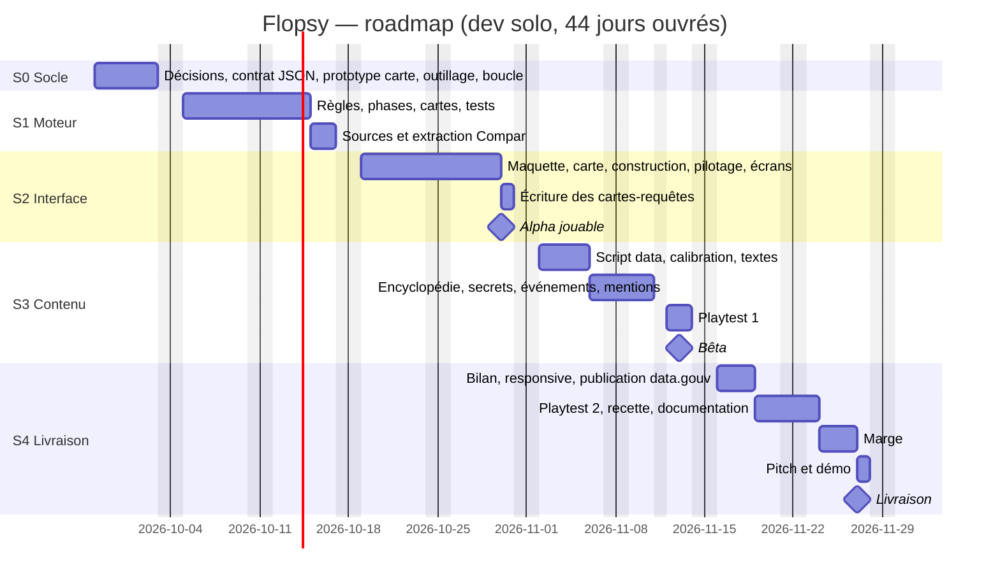

# 6. Roadmap

[← Backlog](05-backlog.md) · [Sommaire](README.md) · [Budget →](07-budget.md)

**Période** : du lundi 28 septembre au vendredi 27 novembre 2026, soit 9 semaines, **44 jours ouvrés** (le mercredi 11
novembre est férié). **Charge** : 40,5 jours de tâches et 3,5 jours de marge.

## Gantt

## Détail des sprints

### S0 — Socle · 28 sept. → 2 oct. · 5 j

| Tâches                                                                                                      |                         Jours |
|-------------------------------------------------------------------------------------------------------------|------------------------------:|
| T01 Décisions de jeu · T02 Contrat JSON · T03 Prototype de carte · T04 Outillage · T05 Boucle de simulation | 1 + 0,5 + 1 + 1 + 1,5 = **5** |

**Objectif** : les décisions sont prises, le dépôt est prêt et le moteur tourne à vide.

### S1 — Moteur · 5 → 16 oct. · 10 j

| Tâches                                                                                                                              |                                     Jours |
|-------------------------------------------------------------------------------------------------------------------------------------|------------------------------------------:|
| T06 Énergie · T07 Métaux · T08 Demande · T09 Confiance · T10 Fins · T11 Phase 2 · T12 Cartes (moteur) · T14 Test de partie complète | 1,5 + 1 + 1 + 1 + 0,5 + 1,5 + 1 + 0,5 = 8 |
| T15 Sources et licences · T16 Extraction Compar:IA                                                                                  |                                 1 + 1 = 2 |
| **Total**                                                                                                                           |                                    **10** |

**Objectif** : une partie complète se joue dans la console, et toutes les sources sont identifiées.

### S2 — Interface · 19 → 30 oct. · 10 j

| Tâches                                                                                                                                            |                                         Jours |
|---------------------------------------------------------------------------------------------------------------------------------------------------|----------------------------------------------:|
| T22 Maquette et jauges · T23 Carte iso · T24 Caméra · T25 Construction · T26 Pilotage · T27 Modale cartes · T28 Menus et fins · T32 Bulles d'aide | 1,5 + 2 + 0,5 + 1,5 + 1 + 0,5 + 1,5 + 0,5 = 9 |
| T17 Écriture des cartes-requêtes                                                                                                                  |                                             1 |
| **Total**                                                                                                                                         |                                        **10** |

**🎯 Jalon Alpha (30 oct.)** : une partie se joue de bout en bout dans le navigateur, encore avec des valeurs
provisoires.

### S3 — Contenu · 2 → 13 nov. (sans le 11) · 9 j

| Tâches                                                                 |                 Jours |
|------------------------------------------------------------------------|----------------------:|
| T18 Script data · T19 Calibration · T20 Textes sourcés                 |     1,5 + 1,5 + 1 = 4 |
| T29 Encyclopédie · T30 Secrets · T13 Événements · T34 Mentions légales | 1 + 1 + 1 + 0,5 = 3,5 |
| T35 Playtest 1                                                         |                   1,5 |
| **Total**                                                              |                 **9** |

**🎯 Jalon Bêta (13 nov.)** : vraies données, secrets et fiches en place, premier playtest fait.

### S4 — Livraison · 16 → 27 nov. · 10 j

| Tâches                                                                  |             Jours |
|-------------------------------------------------------------------------|------------------:|
| T31 Bilan · T33 Responsive et accessibilité · T21 Publication data.gouv | 1 + 1 + 0,5 = 2,5 |
| T36 Playtest 2 · T37 Recette · T38 Documentation                        |     1 + 1 + 1 = 3 |
| **Marge**                                                               |           **3,5** |
| T39 Pitch et démo                                                       |                 1 |
| **Total**                                                               |            **10** |

**🎯 Livraison (27 nov.)** : jeu en ligne, données publiées, documentation à jour, démo prête.

## Risques et parades

| Risque                                           | Signal d'alerte                                                   | Parade                                                                     |
|--------------------------------------------------|-------------------------------------------------------------------|----------------------------------------------------------------------------|
| L'équilibrage prend plus de temps que prévu      | Les parties du playtest 1 durent moins de 8 min ou plus de 20 min | Utiliser la marge ; tout est dans `params.json`, donc aucun code à toucher |
| Rendu de la carte trop lent ou trop long à coder | Le prototype T03 n'atteint pas 60 images/s, ou T23 dépasse 2 j    | Passer à une grille 2D vue du dessus                                       |
| Écriture des cartes trop longue                  | T17 n'est pas fini en fin de S2                                   | Descendre à 30 cartes, en gardant toutes les catégories                    |
| Retard sur le moteur                             | T09 n'est pas fini le 12 octobre                                  | Simplifier la formule de confiance (2 termes au lieu de 4)                 |
| Imprévu (malade, autre projet)                   | Plus d'1 jour de retard sur un jalon                              | Marge de 3,5 j ; ensuite, couper T31 (bilan) puis T13 (événements)         |

## Suivi

- **Chaque lundi** : mettre à jour le board GitHub Projects et comparer l'avancement à ce tableau.
- **À chaque jalon** : déployer une version taguée (`v0.1-alpha`, `v0.2-beta`, `v1.0`) et noter les écarts dans ce
  chapitre.
